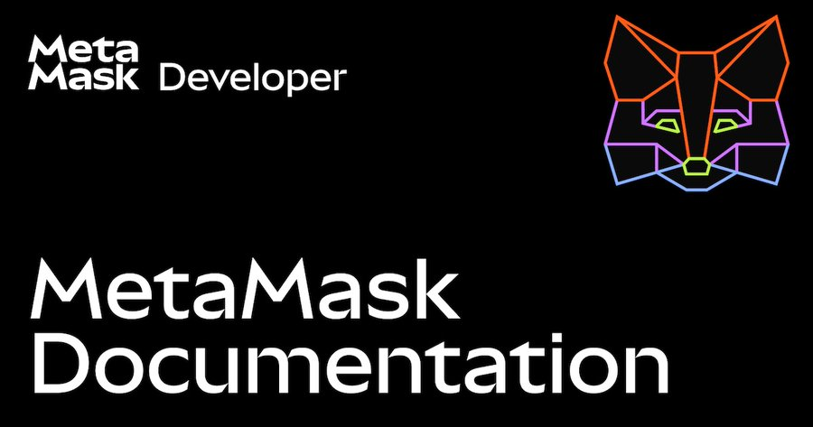

Vitalik: role of L2s has changed, Hegotá upgrade headliner proposals, Lido v3 live

### Ecosystem

* Vitalik: [role of L2s in Ethereum ecosystem has changed](https://x.com/VitalikButerin/status/2018711006394843585)  
  * mainnet is scaling (low fees & gas limit increasing)  
  * L2s progress to stage 2 & interoperability is slower & more difficult than expected  
  * L2s should [bring something new & vibes should match substance](https://x.com/VitalikButerin/status/2019341766407725170)  
  * Response from L2s: [Steven](https://x.com/sgoldfed/status/2018834553746444344) (Offchain Labs), [Jesse](https://x.com/jessepollak/status/2018786985402597742) (Base), [Jing](https://x.com/jinglejamOP/status/2018809312534303074) (OP Labs), [Eli](https://x.com/EliBenSasson/status/2019710815138427111) (Starknet), [Declan](https://x.com/declanfox14/status/2018833187485422040) (Linea), [Alex](https://x.com/gluk64/status/2018966839603388485) (ZKsync) & [Hayden](https://x.com/haydenzadams/status/2018739946706596309) (Unichain)  
* Ethereum Foundation:  
  * [Trillion dollar security dashboard](https://trilliondollarsecurity.org/): overview of security across 6 dimensions  
  * [PhD fellowship program](https://esp.ethereum.foundation/rounds/phdfp26), $24k stipend, April 1 deadline  
* ETHChiangmai [hackathon winners](https://x.com/ETHChiangmai/status/2018327225960161508)  
* ETH metrics:  
  * [Gas](https://ultrasound.money/#gas) (gwei): 1.0 average, 0.0 \- 49.7 (12.4 for zero net issuance)  
  * [ETH supply change](https://ultrasound.money/): 17.5k net issuance  
  * [ETHUSD](https://www.coingecko.com/en/coins/ethereum): $1,825 \- $2,739 (all time high $4,946, August 24, 2025\)  
  * [ETH ETFs](https://dune.com/hildobby/eth-etfs): 5% of ETH supply  
  * [ETHBTC](https://ratiogang.com/): 0.029 (0.166 for the Flippening)

---

### Sponsor: [MetaMask](https://metamask.io/)

AI agents can now use the MetaMask Smart Accounts Kit with OpenClaw. 🦊🦞

This OpenClaw skill teaches agents how to:

* Create embedded smart accounts  
* Set up delegations  
* Request Advanced Permissions

Install the skill: [use the Smart Accounts Kit with OpenClaw](https://docs.metamask.io/smart-accounts-kit/get-started/use-with-openclaw/)  

---

### Enterprise

* Universal [USDU](https://www.universal.ae/news/universal-launches-uaes-first-central-bank-registered-usd-stablecoin) stablecoin live on [mainnet](https://etherscan.io/token/0xe4ca6596D2C28014C6f89964F57838e0bE9f369B), registered with UAE central bank  
* [Y Combinator](https://x.com/ycombinator/status/2018701008986370333): startups can receive their $500k funding in stablecoins

### Applications

* Blockscout (block explorer) [Tor native version](https://x.com/blockscout/status/2019448662963970554)  
* Privacy Pools [wen withdraw](https://www.wenwithdraw.xyz/) (dashboard): view deposit/withdrawal volume & timing  
* [Aave Labs](https://avara.xyz/blog/the-future-of-family-wallet): Family (wallet) iOS app winding down, Avara brand no longer in use  
* [wei names](https://x.com/z0r0zzz/status/2018072557682082277) (name service) live on mainnet; [wei.limo](https://wei.limo/) web gateway for .eth & .wei names  
* Small Brain [merch store](https://merch.smallbrain.xyz/) uses maybe pay, live on Abstract, amount overpaid increases chance of a full refund  
* Vitalik proposes [creator DAOs](https://www.reddit.com/r/ethereum/comments/1qsysag/how_i_would_do_creator_coins/) to incentivize quality content creation, DAOs earn proceeds from content & burn creator coins of new members using a portion of proceeds

### Developers

* Hardhat (dev framework) [v3.1.7](https://github.com/NomicFoundation/hardhat/releases/tag/hardhat%403.1.7): adds getProof support; [v3.1.6](https://github.com/NomicFoundation/hardhat/releases/tag/hardhat%403.1.6): adds build hook for plugins  
* act [v0.2.0](https://github.com/argotorg/act/releases/tag/v0.2.0) (formal specification language): reimplementation of v0.1 prototype  
* Paul Berg   
  * [Effect EVM](https://github.com/PaulRBerg/prb-effect/tree/main/evm#readme) (client library): Effect-TS, built on viem, beta   
  * [Effect EVM Safe](https://github.com/PaulRBerg/prb-effect/tree/main/evm-safe#readme): Effect-TS for Safe multisig apps, beta  
* [Voltaire](https://github.com/evmts/voltaire#readme) (client library): production ready: Zig & TypeScript; beta: Python, Rust, Go & Swift  
* [Brane](https://brane.sh/) (client library): type-safe Java 21 SDK  
* Walletbeat [wallet test playground](https://beta.walletbeat.eth.limo/test/): test transactions, signatures & EIP support  
* [Interoperable addresses](https://interopaddress.com/) SDK & playground: ERC7930 (binary format for use in contracts) & ERC7828 (human readable)  
* ERC4337 (account abstraction) [censorship & griefing vector](https://erc4337.substack.com/p/improving-useroperation-execution), fixed in EntryPoint v0.9  
* [create-8004-agent](https://github.com/Eversmile12/create-8004-agent#readme) (CLI): scaffold ERC8004 & x402 v2 AI agents  
* [Farcaster agent](https://github.com/rishavmukherji/farcaster-agent#readme) (skill): create account for $1, add signer key for posting & post casts  
* Argot Collective [Q3/Q4 transparency report](https://www.argot.org/reports/transparency-report-2025): $2.4M in expenditure for Solidity, Sourcify, hevm, Fe, ethdebug & Act  
* Application layer standards (ERCs):  
  * [ERC8143](https://github.com/ethereum/ERCs/pull/1504/changes): Smart credential resolution interface  
  * [ERC8144](https://github.com/ethereum/ERCs/pull/1508/changes): Multi-chain GS1 product identifier resolver  
  * [ERC8147](https://github.com/ethereum/ERCs/pull/1510/changes): Locality-preserving storage layout for binary trie  
  * [ERC8150](https://github.com/ethereum/ERCs/pull/1520/changes): Zero-knowledge agent payment verification

### Security

* CrossCurve (formerly EYWA) bridge [$1.4M exploit](https://x.com/MixBytes/status/2018304206763892766)  
* Gyroscope GYD crosschain contract [300 ETH exploit](https://x.com/GyroStable/status/2017546048114250219)  
* Safe: [address poisoning & social engineering campaign](https://x.com/SafeLabs_/status/2019709903946879149) targeting multisig users

### All core devs (main protocol calls)

#### All core devs \- consensus (ACDC) [\#174](https://forkcast.org/calls/acdc/174)

* [Hegotá](https://forkcast.org/upgrade/hegota/) upgrade (targeting late-2026)  
  * Proposed headliners (consensus layer):  
    * [EIP7805](https://ethereum-magicians.org/t/hegota-headliner-proposal-focil-eip-7805/27604) Fork-choice enforced Inclusion Lists (FOCIL)  
    * [Partial reconstruction & 2D PeerDAS](https://ethereum-magicians.org/t/hegota-headliner-partial-reconstruction-and-2d-peerdas/27652)  
  * Consensus layer headliner to be selected at next ACDC  
  * FOCIL most likely headliner with strong support from client teams  
* Blobs:   
  * [EIP8136](https://github.com/ethereum/EIPs/pull/11176/changes) cell-level deltas: exchange missing cells rather than full data columns, client teams implementing, backwards compatible, enable via a feature flag & doesn’t need a network upgrade

#### All core devs \- testing (ACDT) [\#68](https://forkcast.org/calls/acdt/068/)

* [Glamsterdam](https://forkcast.org/upgrade/glamsterdam) upgrade (targeting mid-2026):  
  * [EIP7732](https://forkcast.org/eips/7732) ePBS:  
    * [epbs-devnet-0](https://notes.ethereum.org/@ethpandaops/epbs-devnet-0): still targeting late February, based on subset of consensus spec [v1.7.0-alpha.2](https://github.com/ethereum/consensus-specs/releases/tag/v1.7.0-alpha.2)

### Layer 1

* [Glamsterdam](https://forkcast.org/upgrade/glamsterdam) upgrade (targeting mid-2026):  
  * [EIP7928](https://forkcast.org/eips/7928/) Block-level Access Lists:  
    * [bal-devnet-2](https://notes.ethereum.org/@ethpandaops/bal-devnet-2) planned to launch this week  
  * Potuz’s annotated Gloas spec: [fork choice](https://www.potuz.net/posts/gloas-annotated-forkchoice/)  
  * Glamsterdam repricings breakout [\#1](https://forkcast.org/calls/price/001/)  
* [Hegotá](https://forkcast.org/upgrade/hegota/) upgrade (targeting late-2026)  
  * [Headliner proposals](https://ethereum-magicians.org/t/eip-8081-hegota-network-upgrade-meta-thread/26876) (create your [ranking](https://forkcast.org/rank)):  
    * Consensus layer:  
      * [EIP7805](https://ethereum-magicians.org/t/hegota-headliner-proposal-focil-eip-7805/27604) Fork-choice enforced Inclusion Lists  
      * [Partial reconstruction & 2D PeerDAS](https://ethereum-magicians.org/t/hegota-headliner-partial-reconstruction-and-2d-peerdas/27652)  
    * Execution layer:  
      * [EIP8141](https://ethereum-magicians.org/t/hegota-headliner-proposal-frame-transaction/27618) frame transaction (post-quantum security, native account abstraction & gas sponsorship)  
      * [EIP8105](https://ethereum-magicians.org/t/hegota-headliner-proposal-eip-8105-universal-enshrined-encrypted-mempool-eem/27448) encrypted transaction pool  
      * [EIP7807](https://ethereum-magicians.org/t/hegota-headliner-proposal-ssz-execution-blocks/27619) SSZ execution blocks  
      * [LUCID encrypted transaction pool](https://ethereum-magicians.org/t/hegota-headliner-lucid-encrypted-mempool/27658)  
* Post quantum transaction signatures [\#1](https://forkcast.org/calls/pqts/001)  
* Ethereum improvement proposals (EIPs):  
  * [EIP8145](https://github.com/ethereum/EIPs/pull/11240/changes): Namespaced storage in binary trie  
  * [EIP8146](https://github.com/ethereum/EIPs/pull/11254/changes): Block access list sidecars  
  * [EIP8148](https://github.com/ethereum/EIPs/pull/11265/changes): Custom sweep threshold for validators  
  * [EIP8149](https://github.com/ethereum/EIPs/pull/11266/changes): Multi KZG point evaluation precompile

### Research

* Vitalik: [new forms of state](https://ethresear.ch/t/hyper-scaling-state-by-creating-new-forms-of-state/24052) for 1000x scaling, add temporary storage with resurrection or UTXOs, keeping existing state mostly as is (but relatively more expensive)  
* Jordi Baylina: [synchronous composability between rollups](https://ethresear.ch/t/synchronous-composability-between-rollups-via-realtime-proving/23998) via realtime proving  
  * Martin Köppelmann: [synchronous rollup](https://github.com/koeppelmann/synchronous_surge#readme) proof of concept

### Staking

* Lido [v3](https://blog.lido.fi/lido-v3-is-live-modular-infrastructure-for-a-new-paradigm-of-ethereum-staking/) live, adds modular staking vaults (stVaults), vault owners define staking setups & staked deposits can mint stETH  
* [Staking marketshare](https://dune.com/hildobby/eth2-staking): Lido 23% \[Note: [dual governance](https://dg.lido.fi/)\]  
* [Validators](https://pectrified.com/mainnet): 971k active  
* Client releases:  
  * Consensus layer:  
    * Lighthouse [v8.1.0](https://github.com/sigp/lighthouse/releases/tag/v8.1.0) (recommended): performance optimizations, validator client improvements & bug fixes  
    * Lodestar [v1.39.1](https://github.com/ChainSafe/lodestar/releases/tag/v1.39.1): arm64 docker image was missing a dependency  
  * Execution layer:  
    * Besu [26.1.0](https://github.com/hyperledger/besu/releases/tag/26.1.0) (recommended): performance improvements for getBlobsV2 & getPayload and adds getBlobsV3

### Layer 2

* Base [transaction inclusion delays](https://base-l2.statuspage.io/incidents/kn3x59zv9ssz) on February 6 & [transaction drops & inclusion delays](https://base-l2.statuspage.io/incidents/zfvvgt46j9d8) on January 31

### General

* EF dAI: [setup OpenClaw](https://ai.ethereum.foundation/blog/openclaw-security-guide) (AI assistant) on a Raspberry Pi with reduced attack surface; Risks: prompt injection, trust AI provider, physical access & user error  
* [Notepad++](https://notepad-plus-plus.org/news/hijacked-incident-info-update/) auto-updater compromised from June to December 2 by state-sponsored group targeting specific high-value organizations

---

*Editor: [@abcoathup](https://x.com/abcoathup)*  
*Permalink: [ethereal.news/ethereal-news-weekly-10](https://ethereal.news/ethereal-news-weekly-10/)*  
*Markdown: [ethereal.news/ethereal-news-weekly-10.md](https://ethereal.news/ethereal-news-weekly-10.md)*

---
