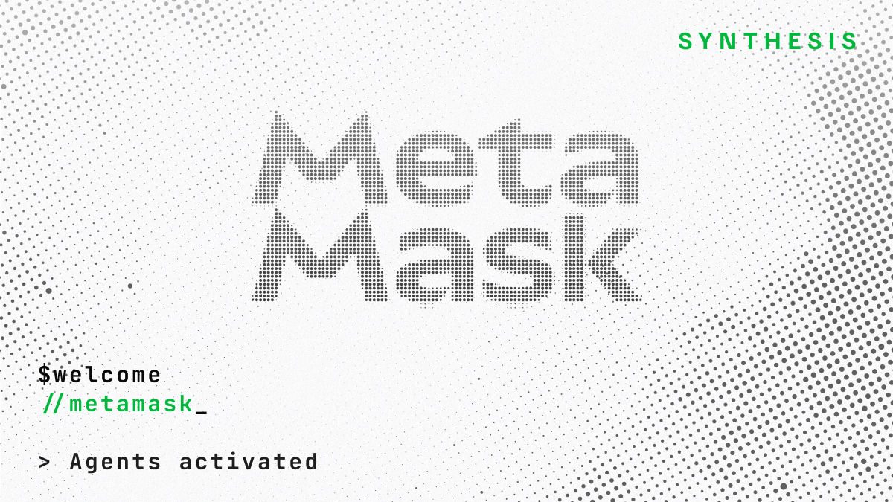

US DoJ seeks Roman Storm retrial, BlackRock staked ETH ETF live, EF bug bounty $1M max payout

### Ecosystem

* Ethereum Foundation:
  * [Bug bounty](https://x.com/fredrik0x/status/2031094726271672488) maximum payout increased to $1M (up from $250k)
  * EF Ecosystem Support Program [funded projects](https://esp.ethereum.foundation/funded-projects) explorer, 1042 projects across 2024-2026
* Vitalik:
  * Proposal to [switch from Casper FFG to Minimmit](https://www.reddit.com/r/ethereum/comments/1rmmoln/minimmit_vs_casper_ffg/) as finality gadget
  * [Ethereum value from first principles](https://x.com/VitalikButerin/status/2032091657819316620): blobs as a bulletin board, ETH for payment & contracts as a shared programming layer
* ETH metrics:
  * [Gas](https://ultrasound.money/#gas) (gwei): 0.1 average, 0.0 \- 1.4 (12.5 for zero net issuance)
  * [ETH supply change](https://ultrasound.money/): 19k net issuance
  * [ETHUSD](https://www.coingecko.com/en/coins/ethereum): $1,931 \- $2,128 (all time high $4,946, August 24, 2025\)
  * [ETH ETFs](https://dune.com/hildobby/eth-etfs): 5% of ETH supply
  * [ETHBTC](https://ratiogang.com/): 0.029 (0.166 for the Flippening)

---

### Sponsor: [MetaMask](https://metamask.io/)

MetaMask is joining the Synthesis agent hackathon. 🤖

Agents register with their own identity, build, compete, and get evaluated by both agentic judges and humans.

Build agentic apps with the world's leading self-custodial crypto wallet using advanced permissions and the Smart Accounts Kit.

The Synthesis hackathon starts March 13\.

Register now: [synthesis.md](https://synthesis.md/)

---

### Enterprise

* [BlackRock](https://www.ishares.com/us/literature/press-release/ethb-press-release.pdf) staked ETH ETF (ETHB) live
* [Nasdaq](https://www.globenewswire.com/news-release/2026/03/09/3251680/6948/en/Nasdaq-to-launch-equity-token-design-putting-issuers-at-the-center-of-tokenization.html) to launch equity token design, partnering with Payward (Kraken parent) to connect xStocks, targeting H1 2027
* [Intercontinental Exchange](https://ir.theice.com/press/news-details/2026/ICE-Makes-Investment-in-OKX-Establishing-Strategic-Relationship/default.aspx) (NYSE parent) invests in OKX, will license spot crypto prices & launch US regulated futures
* Mastercard [crypto partner program](https://www.mastercard.com/us/en/news-and-trends/stories/2026/mastercard-crypto-partner-program.html): collaboration with 85 crypto projects, payment providers & financial institutions

### Applications

* [on.eth](https://ens.domains/blog/post/on-eth-chain-registry) chain metadata registry: enables interoperable names e.g. vitalik.eth@base; registered chains: mainnet, Arbitrum One, Base & OP Mainnet
* Aave:
  * [wstETH CAPO risk oracle misconfiguration](https://governance.aave.com/t/post-mortem-exchange-rate-misallignment-on-wsteth-core-and-prime-instances/24269), $700k loss, protocol incurred no bad debt, users to be reimbursed
  * [$50M swapped for just $36k of AAVE](https://x.com/StaniKulechov/status/2032193345414664659) via Aave interface
* [Across](https://forum.across.to/t/the-bridge-across/2097) proposal to convert from a DAO to a private company
* POAP (Proof of Attendance Protocol) going into [maintenance mode](https://x.com/izgnzlz/status/2032181803155333626), no new issuers from March 16
* [Gitcoin](https://gov.gitcoin.co/t/proposal-gitcoin-d-acc-2026-funding-initiative-restructuring-the-grants-program/25157) proposal to replace Gitcoin grants with single domain campaign per year & monthly subdomain campaigns
* [.eth leaderboard](https://ethleaderboard.com/): X accounts with .eth names by follower count

### Developers

* Solidity [v0.8.35-pre.1](https://github.com/argotorg/solidity/releases/tag/v0.8.35-pre.1) (language): experimental mode enabled by flag and recorded in JSON & CBOR metadata
* Trail of Bits: [ERC4337 smart account vulnerability patterns](https://blog.trailofbits.com/2026/03/11/six-mistakes-in-erc-4337-smart-accounts/)
* Hardhat [v3.1.12](https://github.com/NomicFoundation/hardhat/releases/tag/hardhat%403.1.12) (dev framework): adds function gas snapshots & snapshot cheatcodes in Solidity tests
* Nethereum [6](https://github.com/Nethereum/Nethereum/releases/tag/6.0.0) (.NET client library): adds in process node, dev network with SQLite persistence & multinode app chain, account abstraction, block explorer, multiprovider storage & .NET Aspire orchestration
* Wighawag [purgatory](https://github.com/wighawag/purgatory#readme): local transaction pool proxy
* [Base App web apps](https://x.com/buildonbase/status/2032126286542311778) migrating from Farcaster mini-app tooling
* BuidlGuidl: [shifting to AI native developer stack](https://x.com/buidlguidl/status/2030977075226480821), Scaffold-ETH: agent first docs, skills rather than scripts & AI-assisted code review; Speedrun Ethereum: per challenge context file & AI teacher mode
* Application layer standards (ERCs):
  * [ERC8187](https://github.com/ethereum/ERCs/pull/1587/changes): Token puller
  * [ERC8190](https://github.com/ethereum/ERCs/pull/1592/changes): Payment channels with signed vouchers
  * [ERC8191](https://github.com/ethereum/ERCs/pull/1595/changes): Onchain recurring payments
  * [ERC8192](https://github.com/ethereum/ERCs/pull/1597/changes): Mandated execution for tokenized vaults
  * [ERC8193](https://github.com/ethereum/ERCs/pull/1599/changes): OAuth with Ethereum

### Agents

* [ERC8183 agentic commerce](https://x.com/virtuals_io/status/2031042423288426979) explainer
* [OpenSea CLI](https://github.com/ProjectOpenSea/opensea-cli#readme) ([skill](https://raw.githubusercontent.com/ProjectOpenSea/opensea-skill/refs/heads/main/SKILL.md)): query NFTs, listings & swaps
* [Computer pizza](https://www.computerpizza.xyz/): order Domino’s & pay with USDC on mainnet

### Security

* Gondi [sell & repay exploit](https://x.com/gondixyz/status/2031022009224712358), 78 NFTs stolen
* Joran Honig [Grimoire](https://github.com/JoranHonig/grimoire#readme) (security research toolkit): set of skills, agents, tools & plugins
* ZeroSkills [slot sleuth](https://github.com/zerocoolailabs/ZeroSkills?tab=readme-ov-file#slot-sleuth-code_sleuthmd): EVM storage-safety vulnerability detector
* [AI security review tools compared](https://x.com/z0r0zzz/status/2031755989968642511) using Moloch (Majeur) contract
* Cyfrin Updraft [.env pledge](https://envpledge.eth.limo/) to not store keys & seed phrases in .env files, mint soulbound NFT

### All core devs (main protocol calls)

#### All core devs \- execution (ACDE) [\#232](https://forkcast.org/calls/acde/232/)

* [Glamsterdam](https://forkcast.org/upgrade/glamsterdam) upgrade (targeting mid-2026):
  * bal-devnet-3 ([spec](https://notes.ethereum.org/@ethpandaops/bal-devnet-3)): launch delayed, complexity concerns for [EIP8037](https://forkcast.org/eips/8037/) state creation gas cost increase
* [Hegotá](https://forkcast.org/upgrade/hegota/) upgrade (targeting late-2026):
  * Headliner (execution layer):
    * Decide headliner at next ACDE, default is no headliner
    * [EIP8141](https://forkcast.org/eips/8141/) Frame transactions is only remaining candidate, Geth & Erigon support, to be selected would need additional teams to support
    * Declined for Inclusion: [EIP8184](https://github.com/ethereum/EIPs/pull/11376/changes) LUCID encrypted transaction pool & [EIP7807](https://forkcast.org/eips/7807) SSZ execution blocks

#### All core devs \- testing (ACDT) [\#73](https://forkcast.org/calls/acdt/073/)

* Glamsterdam upgrade devnets: [bal-devnet-2](https://bal-devnet-2.ethpandaops.io/) & [epbs-devnet-0](https://epbs-devnet-0.ethpandaops.io/)

### Layer 1

* [Glamsterdam](https://forkcast.org/upgrade/glamsterdam) upgrade (targeting mid-2026):
  * [Gas repricing survey results](https://x.com/EFprotocol/status/2031056150427242892): builder concerns around complexity for EIP8037 multidimensional gas & read operations with EIP8038 state access costs
  * Franco Victorio: [EIP8024 SWAPN, DUPN, EXCHANGE explainer](https://paragraph.com/@cethology/eip-8024-or-killing-the-stack-too-deep-error), solves stack too deep error
* [Hegotá](https://forkcast.org/upgrade/hegota/) upgrade (targeting late-2026):
  * EIP7805 FOCIL breakout [\#30](https://x.com/jih2nn/status/2031765457817251896)
  * [Binary SSZ for Engine API](https://ethresear.ch/t/binary-ssz-transport-for-the-engine-api-an-initial-benchmark-on-a-live-network-with-kurtosis/24324): proposal to add optional SSZ encoding, getPayload takes 5-36ms with SSZ compared to 63-446ms with JSON
  * [Snap v2](https://ethresear.ch/t/snap-v2-replacing-trie-healing-with-bals/24333): proposal to replace snap sync trie healing phase using state diffs from Block-Level Access Lists
* L1-zkEVM breakout [\#2](https://forkcast.org/calls/zkevm/002)
* Ethereum improvement proposals (EIPs):
  * [EIP8188](https://github.com/ethereum/EIPs/pull/11390/changes): Tiered state write pricing
  * [EIP8189](https://github.com/ethereum/EIPs/pull/11391/changes): snap/2 \- BAL-based state healing

### Staking

* [Client diversity](https://clientdiversity.org/#distribution):
  * Consensus layer: Lighthouse \~51% (data may not be accurate)
  * Execution layer: Geth \~41%, Nethermind \~38% (estimated from self reports)
  * Lido [Q4 metrics](https://blog.lido.fi/lido-validator-and-node-operator-metrics-q4-2025/): Lighthouse 28% & Simple DVT: Nethermind 55% & CSM: Nethermind 60%
* [Staking marketshare](https://dune.com/hildobby/eth2-staking): Lido 23% \[Note: [dual governance](https://dg.lido.fi/)\]
* [Validators](https://pectrified.com/mainnet): 950k active (target 128k)
* Teku [SSZ serialization post mortem](https://hackmd.io/@teku/r1AiIS_FWg), nodes couldn’t save state to disk
* Client releases:
  * Consensus layer:
    * Grandine [2.0.3](https://github.com/grandinetech/grandine/releases/tag/2.0.3) (high): security fixes & performance optimizations
    * Lighthouse [v8.1.2](https://github.com/sigp/lighthouse/releases/tag/v8.1.2) (high): patch with security-critical fixes
  * Execution layer:
    * Besu [26.2.0](https://github.com/besu-eth/besu/releases/tag/26.2.0) (recommended): chain pruning CLI options redesigned & EVM performance optimizations
    * Erigon [v3.3.9](https://github.com/erigontech/erigon/releases/tag/v3.3.9): smoother transaction pool, improved peer discovery & enhanced RPC reliability
    * Reth [v1.11.3](https://github.com/paradigmxyz/reth/releases/tag/v1.11.3) (high): fix panic in sparse trie proof workers

### Layer 2

* EIP8079 [native rollup proof of concept](https://x.com/ethrex_client/status/2031356365961122164) using ethrex
* L2Beat [alt-DA stages framework](https://forum.l2beat.com/t/alt-da-stages-framework-call-for-feedback/414) proposal

### Regulation

* [US DoJ seeks Roman Storm retrial](https://x.com/rstormsf/status/2031204201418883256) on two counts; donate to [free Roman Storm](https://freeromanstorm.com/)
* US Treasury report to congress: [tech to counter illicit finance involving crypto](https://home.treasury.gov/system/files/246/GENIUS-Act-Illicit-Finance-Innovation-Congressional-Report-March-2026.pdf), notes lawful users may leverage mixers for financial privacy
* US SEC & CFTC [memorandum of understanding](https://www.sec.gov/newsroom/press-releases/2026-26-sec-cftc-announce-historic-memorandum-understanding-between-agencies) to coordinate/collaborate

### General

* [Signal account takeovers](https://x.com/signalapp/status/2031038277604585785) via phishing attacks
* Plonky3 [v0.5.0](https://x.com/RobinSalen/status/2031388330412355997): faster lookups, Poseidon2 optimizations, higher-arity folding & Poseidon1 support

---

*Editor: [@abcoathup](https://x.com/abcoathup)*
*Permalink: [ethereal.news/ethereal-news-weekly-15/](https://ethereal.news/ethereal-news-weekly-15/)*
*Markdown: [ethereal.news/ethereal-news-weekly-15.md](https://ethereal.news/ethereal-news-weekly-15.md)*

---
