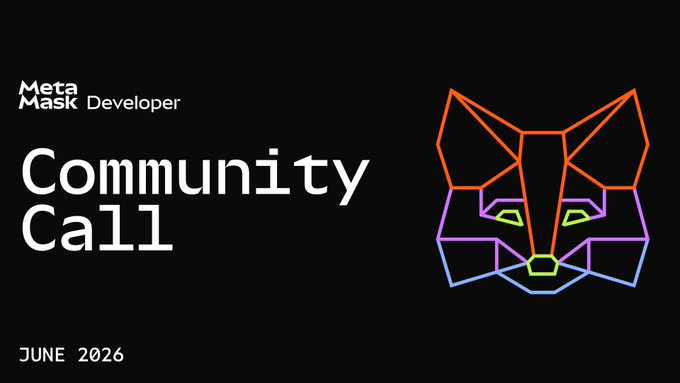

*Strawmap updated, Ethereum Foundation restructure, Ethlabs launched*

### Ecosystem

* [Strawmap](https://strawmap.org/) (strawman roadmap) updated; includes proposed issuance change (snail issuance) potentially in I\* upgrade  
* [Ethereum Foundation restructure](https://blog.ethereum.org/2026/06/23/ef-structure), five domain clusters: protocol, access, user, community & institutional layers; 54 fewer staff (\~20%)  
  * Vitalik: [budget decreasing \~40%](https://x.com/VitalikButerin/status/2069431500035023121), transitioning to long term oriented endowment based organization; to accomplish Strawmap (third iteration of Ethereum) & increasing EF role in access layer, budget sacrifices include:  
    * **Clients**: multi-client model shifting from redundancy to specialization, exploring security strategy of AI assisted formal verification  
    * **Privacy Stewards of Ethereum**: PSE winding down; focus on implementing (rather than exploring) ZKP privacy & scaling  
    * **Devcon**: likely to be smaller & more spartan  
    * **Beyond-Ethereum megaprojects**: Vitalik funding some personally  
    * **EF institutional work**: scope reducing  
  * Tomasz Stańczak (former co-Executive Director): [strategically, list is good](https://x.com/tkstanczak/status/2069454499509596582)  
  * Bastian Aue (interim co-Executive Director) [execution of EF mandate](https://x.com/aerugoettinea/status/2069017140846330107):   
    * EF is for **eliminating weaknesses** (e.g. EF dogfooding ETH/stablecoins & preventing toxic MEV) and **seizing opportunities**  
    * **Departures**: mix of resignations & terminations due to strategy, role fit, normal change & best contribution elsewhere  
    * **Spinouts**: mix of better homes, markets should decide worth, not mandate compatible & useful but not EF work  
* [Ethlabs](https://ethlabs.org/thesis.html) launched, non-profit R\&D lab for Ethereum & ETH  
  * Founding team (ex-EF protocol): Ansgar Dietrichs, Barnabé Monnot, Caspar Schwarz-Schilling, Josh Rudolf & Julian Ma  
  * [Anchor funding](https://www.globenewswire.com/news-release/2026/06/22/3315546/0/en/ethlabs-founded-by-former-ethereum-foundation-contributors-and-funded-by-bitmine-sharplink-and-joe-lubin-launches-to-accelerate-ethereum-s-institutional-supercycle.html) by Bitmine, Sharplink & Joe Lubin   
* ETH metrics:  
  * [Gas](https://ultrasound.money/#gas) (gwei): 0.3 average, 0 \- 14.3 (13 for zero net issuance)  
  * [ETH supply change](https://ultrasound.money/): 19.5k net issuance (7 days)  
  * [ETHUSD](https://www.coingecko.com/en/coins/ethereum): $1,523 \- $1,774 (all time high $4,946, August 24, 2025\)  
  * [ETH ETFs](https://dune.com/hildobby/eth-etfs): 5.2% of ETH supply  
  * [ETHBTC](https://ratiogang.com/): 0.026 (0.166 for the Flippening)

---

### Sponsor: [MetaMask](https://metamask.io/)

**MetaMask Developer June Community Call. 🦊**

On the agenda:

* Embedded Wallets Mobile SDK releases \+ v9 deprecation updates  
* What's new with MetaMask Connect v2  
* MetaMask Cook-Off Smart Accounts Kit winner presentation 

📅 Thursday, July 2   
⏰ 12:00 PM ET

[Community call registration](https://luma.com/hf8lxh27)

---

### Enterprise

* [Baillie Gifford enhanced yield fund](https://media.bailliegifford.com/mws/h33bxyna/20260622120109-ext-bg-fund-launch-release-approved.pdf) (BAGEY): native UK regulated tokenised fund, token is investor holding (not a wrapper)  
* UBS & Nethermind [two compliance proofs of concept](https://www.ubs.com/global/en/media/display-page-ndp/en-20260623-nethermind.html) on Sepolia testnet; node configured to apply compliance & risk rules; component routed bundles of approved transactions through relay services directly to select builders for reliable inclusion  
* Etherealize: [why permissionless infrastructure wins](https://x.com/Etherealize_io/status/2067999336751849932), Ethereum positioned to become settlement layer for global finance

### Applications

* ENS DAO: [Foundation expansion temp check](https://discuss.ens.domains/t/temp-check-next-era-of-ens-dao-empowering-the-ens-foundation/22175), transfer treasury from DAO & expand board; protocol control remains with token holders  
* Propeller Heads [Turbine](https://www.propellerheads.xyz/blog/turbine): settle large trades at low spread, orders run for user selected deadline (minutes/days) & follow market price via oracles  
* [Uniswap Auctions](https://blog.uniswap.org/launch-auctions-from-uniswap-web-app): configure & launch Continuous Clearing Auctions (CCA) for new & existing tokens directly from web app on mainnet, Arbitrum, Base & Unichain  
* Kain Warwick: [Synthetix sUSD](https://x.com/kaiynne/status/2069277209651724430) being wound down, redeemable for SNX with lockup  
* Reminder: Octant [Epoch 12](https://epoch.octant.app/rounds/0xf9de7a09aebbbacba9a9f4a32874463b2ddc1b8e6b4f6b65014febacbfff13f5) (quadratic funding): 25 projects, 200 ETH matching pool, closes June 30

### Developers

* Fe [v26.2.0](https://blog.fe-lang.org/posts/release-26-2/) (language): adds immutable contract fields, assert\! built-in, const items in impl blocks, bytecode & memory optimizations and defaults to faster compilation rather than optimization  
* Nomic Foundation [Hardhat 2 being sunset](https://hardhat.org/docs/reference/hardhat-2-end-of-life) (dev framework): will be updated for Glamsterdam upgrade and bug & security fixes until end of life (earlier of Hegotá upgrade & June 1, 2027); migrate to Hardhat 3   
* Leo Alt [human readable contract specs in Lean](https://leonardoalt.github.io/human-readable-specs) for evm-smith (AI generated bytecode proven in Lean, experimental)  
* Application layer standards (ERCs):  
  * [ERC8312](https://github.com/ethereum/ERCs/pull/1833/changes): Bounded agent actions  
  * [ERC8313](https://github.com/ethereum/ERCs/pull/1836/changes): Protocol interaction manifest  
  * [ERC8314](https://github.com/ethereum/ERCs/pull/1837/changes): Contract role naming & [ERC8315](https://github.com/ethereum/ERCs/pull/1837/changes): Contract role semantics  
  * [ERC8316](https://github.com/ethereum/ERCs/pull/1840/changes): Programmable settlement locks  
  * [ERC8317](https://github.com/ethereum/ERCs/pull/1841/changes): Contract storage layout descriptor format

### Security

* JaredFromSubway MEV bot [\~$7.5M exploit](https://etherscan.io/tx/0x2be8704f5a59b69e0b71f64aefdb99eb0e8ae9fb3926147c581910d71bcf3e65) via ERC20 allowance drain; banteg [analysis](https://gist.wavey.info/hCH6XqvxIwR27HKdvlVahNGi)  
* Gnosis Guild [Zodiac post-mortem](https://engineering.gnosisguild.org/posts/zodiac-post-mortem): ERC1271 signature check accepted signature based only on returned magic value  
* Zero Skills [Symmetry Sniper](https://x.com/ZeroCool_AI/status/2069443859327705497) (skill): finds asymmetric logic in functions that should mirror each other e.g. deposit/withdraw, mint/burn

### All core devs (main protocol calls)

#### All core devs \- consensus (ACDC) [\#181](https://forkcast.org/calls/acdc/181/)

* [Glamsterdam](https://forkcast.org/upgrade/glamsterdam) upgrade (targeting 2026):  
  * [glamsterdam-devnet-6](https://glamsterdam-devnet-6.ethpandaops.io/) ([spec](https://notes.ethereum.org/@ethpandaops/glamsterdam-devnet-6) & [Dora](https://dora.glamsterdam-devnet-6.ethpandaops.io/) the explorer): launched with remaining EIPs (except [EIP7688](https://forkcast.org/eips/7688/) forward compatible consensus data structures)  
  * glamsterdam-devnet-7 ([spec](https://notes.ethereum.org/@ethpandaops/glamsterdam-devnet-7)): targeting 2-3 weeks, adds [EIP7688](https://forkcast.org/eips/7688/) & updated [EIP8282](https://forkcast.org/eips/8282/) builder execution requests contracts (external security review required)  
  * Declined for Inclusion:  
    * [EIP8080](https://forkcast.org/eips/8080/) let exits use consolidation queue, due to implementation complexity & time; potentially repropose for Hegotá upgrade

#### All core devs \- testing (ACDT) [\#84](https://forkcast.org/calls/acdt/084/) \+ [execution layer](https://forkcast.org/calls/acdt/084/?breakout=el) & [consensus layer](https://forkcast.org/calls/acdt/084/?breakout=cl) breakouts

### Layer 1

* [Glamsterdam](https://forkcast.org/upgrade/glamsterdam) upgrade (targeting 2026):  
  * consensus-specs [v1.7.0-alpha.11](https://github.com/ethereum/consensus-specs/releases/tag/v1.7.0-alpha.11): glamsterdam-devnet-6  
  * Feel Your Protocol: [EIP7928 Block level access lists](https://feelyourprotocol.org/eip-7928-block-level-access-lists/) interactive explainer  
  * Reminder: [Mascot needed](https://ethereum-magicians.org/t/mascot-needed-for-glamsterdam-upgrade/26008), vote on Eth Magicians, closes July 8  
* Ethereum improvement proposals (EIPs):  
  * [EIP8310](https://github.com/ethereum/EIPs/pull/11820/changes): Post quantum keystore for stateful keys  
  * [EIP8311](https://github.com/ethereum/EIPs/pull/11821/changes): Increase calldata floor cost to 96

### Staking

* [Client diversity](https://clientdiversity.org/#distribution):  
  * Consensus layer: Lighthouse \~54% (data may not be accurate)  
* [Staking market share](https://dune.com/hildobby/eth2-staking): Lido 21.5% \[Note: [dual governance](https://dg.lido.fi/)\]  
* [Validators](https://pectrified.com/mainnet): 886k active (target 128k), 15k accumulating (0x02 withdrawal credentials)  
* Client releases:  
  * Consensus layer:  
    * Sigma Prime [Lighthouse v8.2.0](https://github.com/sigp/lighthouse/releases/tag/v8.2.0) (high): security vulnerability fixes, beacon nodes append client info to graffiti by default, validators must specify fee recipient, Glamsterdam upgrade work & [EIP8136](https://forkcast.org/eips/8136/) partial data column support (saves bandwidth, default on Hoodi & Sepolia testnets)  
    * Status [Nimbus v26.6.0](https://github.com/status-im/nimbus-eth2/releases/tag/v26.6.0) (medium): improves performance & resilience  
  * Execution layer:  
    * EF [Geth v1.17.4](https://github.com/ethereum/go-ethereum/releases/tag/v1.17.4) (maintenance): Clef removed to own repo, Glamsterdam upgrade work & performance improvements  
    * Lambda [ethrex v18.0.0](https://github.com/lambdaclass/ethrex/releases/tag/v18.0.0): sync fixes, faster crypto, LEVM hot path optimizations & faster getLogs 

### Research

* Anders Elowsson: [issuance offsets & penalties under low issuance](https://ethresear.ch/t/properties-of-issuance-offsets-and-increased-penalties-under-low-zero-negative-issuance-policies/25292)  
* Mike Neuder: [native zkEVM can scale bandwidth](https://ethresear.ch/t/a-native-zkevm-scales-bandwidth-not-just-execution/25254) (not just execution), by placing block content into blobs (EIP8142 block in blobs)  
* Donnoh: [L2 forced transaction mechanism](https://ethresear.ch/t/repurposing-focil-as-an-l2-forced-transaction-mechanism/25233) via EIP7805 FOCIL  
* Pierre: [cryptographic work to enshrine post quantum private ETH](https://ethresear.ch/t/towards-native-post-quantum-private-eth/25291)  
* Clément Lesaege: [validator redirected revenue](https://ethresear.ch/t/validator-redirected-revenue/25248) proposal, validators signal a percentage of staking rewards to redirect to recipients, majority triggers mandatory redirect

### Layer 2

* L2Beat: [Aztec Network now Stage 2](https://x.com/l2beat/status/2069092241277153772)  
* Base [chain stall](https://status.base.org/incidents/5c4gm1wzbjs4), invalid block halted production, sequencing now resumed  
* Taiko [exploit](https://x.com/taikoxyz/status/2069828265385300282), chain state verification mechanism compromised, bridge to be recollateralized

### Regulation

* Bank of England [draft stablecoin rules](https://www.bankofengland.co.uk/news/2026/june/boe-launches-policy-statement-and-draft-rules-on-regulating-systemic-stablecoins), max 70% in short term UK government debt (interest bearing) & £40B cap per stablecoin   
* US [post quantum executive order](https://www.whitehouse.gov/presidential-actions/2026/06/securing-the-nation-against-advanced-cryptographic-attacks/), federal agencies must migrate encryption by end of 2030 & authentication by end of 2031  
* [Garcia brothers plead guilty](https://www.justice.gov/usao-mn/pr/brothers-plead-guilty-8-million-armed-cryptocurrency-kidnapping-case) to $8M crypto kidnapping of family in Minnesota

### General

* OpenAI [patch the planet](https://openai.com/index/patch-the-planet/), Trail of Bits working with maintainers to investigate & validate vulnerabilities, initial participants include cURL, Go & Python  
* LastPass [Klue supply chain incident](https://blog.lastpass.com/posts/klue-supply-chain-incident-and-lastpass-response), CRM data (names, phone, email & physical addresses) may be affected; customer vaults unaffected  
* Succinct [Flock](https://x.com/SuccinctLabs/status/2070217264398225839): SNARK for proving batches of boolean computations (standard hashes) at less than 250x cost of computing them, research prototype  
* Vitalik: [challenge to find document published not under his name](https://x.com/VitalikButerin/status/2069080988097876084), testing claims AI text analysis makes online anonymity untenable

---

*Editor: [@abcoathup](https://x.com/abcoathup)*  
*Permalink: [ethereal.news/ethereal-news-weekly-29/](https://ethereal.news/ethereal-news-weekly-29/)*  
*Markdown: [ethereal.news/ethereal-news-weekly-29.md](https://ethereal.news/ethereal-news-weekly-29.md)*  

---

