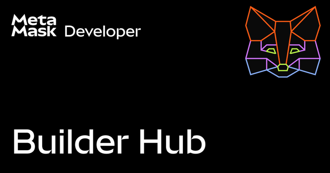

Fidelity Investments FIDD stablecoin, TheDAO Security Fund, Hegotá upgrade headliner proposals

### Ecosystem

* [EF post quantum efforts](https://x.com/drakefjustin/status/2014791629408784816), includes $1M Poseidon Prize to harden Poseidon hash function  
* EF Ecosystem Support Program [Q4 allocations](https://blog.ethereum.org/2026/01/27/allocation-q4-25), 51 projects shared $7.4M  
* ETH metrics:  
  * [Gas](https://ultrasound.money/#gas) (gwei): 0.1 average, 0.0 \- 7.9 (12.4 for zero net issuance)  
  * [ETH supply change](https://ultrasound.money/): 19k net issuance  
  * [ETHUSD](https://www.coingecko.com/en/coins/ethereum): $2,715 \- $3,035 (all time high $4,946, August 24, 2025\)  
  * [ETH ETFs](https://dune.com/hildobby/eth-etfs): 5% of ETH supply  
  * [ETHBTC](https://ratiogang.com/): 0.033 (0.166 for the Flippening)

---

### Sponsor: [MetaMask](https://metamask.io/)

[MetaMask Builder Hub](https://builder.metamask.io/) is where 🦊 devs connect, collaborate, and level up together.  

Access official docs, tutorials, and global community events \- all in one place.  Spend less time searching and more time building.  

[builder.metamask.io](https://builder.metamask.io/)  

---

### Enterprise

* Fidelity Investments [Fidelity Digital Dollar](https://www.fidelitydigitalassets.com/research-and-insights/fidelity-investmentsr-expand-digital-asset-investment-lineup-stablecoin) (FIDD) stablecoin, launching on mainnet

### Applications

* Tether [USAT](https://tether.io/news/tether-announces-the-launch-of-usat-the-federally-regulated-dollar-backed-stablecoin-made-in-america/) stablecoin live on [mainnet](https://etherscan.io/token/0x07041776f5007aca2a54844f50503a18a72a8b68), issued by Anchorage Digital Bank  
* Bitwise [non-custodial vaults](https://bitwiseinvestments.com/newsroom/bitwise-expands-onchain-solutions-with-introduction-of-non-custodial-vault), powered by Morpho  
* Kraken [DeFi Earn](https://blog.kraken.com/product/defi-earn/simplified-defi-rewards): vaults managed by Chaos Labs & Sentora  
* DefiLlama [token rights](https://x.com/DefiLlama/status/2016549586614046873): view governance, treasury & revenue rights for holders  
* Privy Home [key management](https://privy.io/blog/enhanced-wallet-controls-in-privy-home): manage all embedded wallets (apps need to enable)  
* Fileverse [dDocs offline mode v2](https://x.com/fileverse/status/2016902058264166401): offline edits saved to local browser & synced to decentralized storage when online  
* [Nifty Gateway](https://x.com/niftygateway/status/2016254238347891112) shutting April 23; deadline extended after backlash, bulk withdrawal tool planned & metadata migrating to decentralized storage  
* [ERC8004](https://x.com/DavideCrapis/status/2016893815857066212) (trustless agents) live on mainnet; [8004scan](https://x.com/8004_scan/status/2016925782300643640) live

### Developers

* Austin Griffith [Ethereum wingman](https://github.com/austintgriffith/ethereum-wingman#readme) (agent skill): tutor & builder uses Scaffold-ETH 2 (dev framework) & SpeedRun Ethereum  
* Foundry [v1.6.0-rc1](https://github.com/foundry-rs/foundry/releases/tag/v1.6.0-rc1) (dev framework): Osaka default EVM, parallelized stateless fuzzing, configurable invariant check intervals, improved reentrancy detection & time-based invariant fuzzing  
* [Voltaire Effect](https://github.com/evmts/voltaire/tree/main/voltaire-effect#readme) (client library): Effect.ts integration for Voltaire Ethereum primitives  
* Enscribe [contract onchain versioning guide](https://www.enscribe.xyz/blog/smart-contract-versioning), assign ENS names during deployment using Foundry & Hardhat  
* Uniswap Continuous Clearing Auctions: [deployed on Arbitrum](https://x.com/Uniswap/status/2016169975380115789) and Tally [sale simulator](https://www.tally.xyz/sale-simulator)  
* EthereumJS [v10.1.1](https://x.com/EFJavaScript/status/2016517486758248947): Node 24 support, noble curves & hashes upgraded to v2  
* [Stateless history node](https://github.com/vicnaum/stateless-history-node#readme): indexer backfills headers, receipts & logs from execution layer P2P network, serves RPC subset  
* Application layer standards (ERCs):  
  * [ERC8137](https://github.com/ethereum/ERCs/pull/1486/changes): WeissChannels \- crosschain execution for ERC4337 accounts  
  * [ERC8139](https://github.com/ethereum/ERCs/pull/1491/changes): Authorization objects

### Security

* [TheDAO Security Fund](https://paragraph.com/@thedao.fund/thedao-security-fund-activating-75000-eth-for-ethereum-security): fund security initiatives using staking yield from 69,420 ETH  
* Matcha Meta SwapNet [$13M exploit](https://meta.matcha.xyz/SwapNet-Incident-Post-Mortem) and Aperture Finance [$3M exploit](https://x.com/ApertureFinance/status/2015938720453820752)  
* Cyfrin [Solodit API](https://x.com/SoloditOfficial/status/2015808989561315637), query database of 50k contract vulnerabilities  
* Kritt [building AI-assisted security research](https://kritt.ai/technical-review), largest finding awarded $250k  
* [15k system paths found](https://x.com/apoorveth/status/2016801200965112146) in verified contracts, leaking user & device info; check via [Sourcify dataset playground](https://sourcify.dev/#dataset-playground)  
* Cantina [Web3SOC](https://cantina.xyz/blog/web3soc-the-institutional-due-diligence-standard-for-defi): certification evaluating DeFi projects across operational, financial, security & regulatory areas

### All core devs (main protocol calls)

#### All core devs \- consensus (ACDE) [\#229](https://forkcast.org/calls/acde/229)

* [Glamsterdam](https://forkcast.org/upgrade/glamsterdam) upgrade (targeting mid-2026):  
  * [EIP7928](https://forkcast.org/eips/7928/) Block-level Access Lists: mandatory optimizations: parallel execution, batch reading & parallel state root calculation; optional: sync  
  * [Considered for Inclusion](https://forkcast.org/upgrade/glamsterdam/#considered-for-inclusion):  
    * [EIP7610](https://forkcast.org/eips/7610/) revert creation in case of non-empty storage  
  * [Declined for inclusion](https://forkcast.org/upgrade/glamsterdam/#declined-for-inclusion) as non-consensus changes, but clients should standardize:  
    * [EIP7872](https://forkcast.org/eips/7872/) max blob flag for local builders & [EIP7949](https://forkcast.org/eips/7949/) genesis file format  
* [Hegotá](https://forkcast.org/upgrade/hegota/) upgrade (targeting late-2026)  
  * [Headliner proposals](https://ethereum-magicians.org/t/eip-8081-hegota-network-upgrade-meta-thread/26876) (deadline February 4):  
    * [EIP8141](https://ethereum-magicians.org/t/hegota-headliner-proposal-frame-transaction/27618) frame transaction  
    * [EIP8105](https://ethereum-magicians.org/t/hegota-headliner-proposal-eip-8105-universal-enshrined-encrypted-mempool-eem/27448) encrypted transaction pool  
    * [EIP7807](https://ethereum-magicians.org/t/hegota-headliner-proposal-ssz-execution-blocks/27619) SSZ execution blocks  
    * [EIP7805](https://ethereum-magicians.org/t/hegota-headliner-proposal-focil-eip-7805/27604) Fork-choice enforced Inclusion Lists (consensus layer)  
* [Execution layer networking proposals](https://drive.google.com/file/d/1qbYfroCds8_DCpVfzM1qm2HKjYLDntu9/view): EIP8077 & EIP8094

#### All core devs \- testing (ACDT) [\#67](https://forkcast.org/calls/acdt/067/)

* [Glamsterdam](https://forkcast.org/upgrade/glamsterdam) upgrade (targeting mid-2026):  
  * [EIP7928](https://forkcast.org/eips/7928/) Block-level Access Lists:  
    * [bal-devnet-2](https://notes.ethereum.org/@ethpandaops/bal-devnet-2): EIP7888 updated to remove receipt field, launch delayed until next week  
  * Devnet scoping: discussion on prioritization of adding [Considered for Inclusion EIPs](https://forkcast.org/upgrade/glamsterdam/#considered-for-inclusion)

### Layer 1

* [Glamsterdam](https://forkcast.org/upgrade/glamsterdam) upgrade (targeting mid-2026):  
  * Potuz’s annotated Gloas spec: [beacon chain](https://www.potuz.net/posts/gloas-annotated-1/) & [gossip](https://www.potuz.net/posts/gloas-annotated-pubsub/)  
  * [EIP7928](https://forkcast.org/eips/7928/) Block-level Access Lists breakout [\#11](https://forkcast.org/calls/bal/011)  
  * Maria Silva: [compute operations to reprice in EIP7904](https://github.com/misilva73/evm-gas-repricings/blob/main/reports/eip-7904/included_operations.md)  
* Stateless implementers call [\#47](https://x.com/StatelessEth/status/2017120835983880423)  
* [L1-zkEVM roadmap](https://ethereum-magicians.org/t/l1-zkevm-roadmap-2026-integrating-zkevm-proofs-into-ethereums-core-protocol/27595) to integrate zkEVM proofs into core protocol  
* PSE [client-side GPU acceleration roadmap](https://pse.dev/blog/client-side-gpu-everyday-ef-privacy)  
* [Protocol Guild annual report](https://www.protocolguild.org/blog/20260129-annual-report-2025), $12M distributed, $62k median per member  
* Ethereum improvement proposals (EIPs):  
  * Meta [EIP8133](https://github.com/ethereum/EIPs/pull/11161/changes): Network upgrade nomenclature  
  * [EIP8134](https://github.com/ethereum/EIPs/pull/11164/changes): BPO1, [EIP8135](https://github.com/ethereum/EIPs/pull/11165/changes): BPO2 & [EIP8138](https://github.com/ethereum/EIPs/pull/11182/changes): BPO3  
  * Networking [EIP8136](https://github.com/ethereum/EIPs/pull/11176/changes): Cell-level deltas for data column broadcast  
  * [EIP8140](https://github.com/ethereum/EIPs/pull/11194/changes): Token gas payments for [EIP8130](https://github.com/ethereum/EIPs/pull/11144/changes) (account abstraction by account configuration)  
  * [EIP8141](https://eips.ethereum.org/EIPS/eip-8141): Frame transaction (Hegotá upgrade proposed headliner)  
  * [EIP8142](https://github.com/ethereum/EIPs/pull/11212/changes): Block-in-Blobs (BiB)

### Research

* [Node with 1 year of state](https://ethresear.ch/t/what-if-we-only-kept-1-year-of-active-state/23980): \~78% state size reduction, \~15% block re-execution time improvement, read performance accounts for most gains & tail latency improves  
* [Plonky3 Merkle tree theoretically sound](https://x.com/tcoratger/status/2015194890305405022) despite invertible compression, provided leaf hash correctly instantiated  
* [Application-controlled execution](https://ethresear.ch/t/application-controlled-execution-a-case-study-on-cancel-prioritization/23977): analysis of 4 proposed mechanisms

### Staking

* [Withdrawal credentials](https://ethereum.org/developers/docs/consensus-mechanisms/pos/withdrawal-credentials/) guide  
* Flashbots builder-playground [v0.3.0](https://github.com/flashbots/builder-playground/releases/tag/v0.3.0): faster startup, new integrations, improved observability & custom recipes (experimental)  
* [Staking marketshare](https://dune.com/hildobby/eth2-staking): Lido 23.5% \[Note: [dual governance](https://dg.lido.fi/)\]  
* [Validators](https://pectrified.com/mainnet): 975k active  
* Client releases:  
  * Consensus layer:  
    * Lodestar [v1.39.0](https://github.com/ChainSafe/lodestar/releases/tag/v1.39.0) (recommended): migrated to pnpm package manager, removes legacy eth1 code  
    * Nimbus [v26.1.0](https://github.com/status-im/nimbus-eth2/releases/tag/v26.1.0) (low-urgency): improved validator client stability  
  * Execution layer:  
    * Erigon [v3.3.7](https://github.com/erigontech/erigon/releases/tag/v3.3.7): p2p stability & prune performance

### Layer 2

* Linea [Phylax credible layer](https://linea.build/blog/linea-stack-and-mainnet-add-phlyax-credible-layer-onchain-safety) integrated into sequencer, transactions are rejected if they violate assertions defined in Solidity contracts, assertions are [public](https://app.phylax.systems/transparency)  
* Optimism:   
  * [OP Enterprise](https://www.optimism.io/blog/introducing-op-enterprise) (rollup service): managed, self-managed or OP Mainnet  
  * [post-quantum roadmap](https://www.optimism.io/blog/a-post%E2%80%91quantum-roadmap-for-the-superchain), deprecate ECDSA‑based EOAs by 2036  
  * [OP token buy back](https://x.com/Optimism/status/2016874946082005452) approved  
* Ink [Flashblocks](https://x.com/inkonchain/status/2016580569950224419): 200ms block pre-confirmations

### Regulation

* US crypto market structure legislation (Clarity act):  
  * Senate agriculture committee [advanced](https://www.agriculture.senate.gov/newsroom/rep/press/release/boozman-leads-ag-committee-in-advancing-crypto-market-structure-legislation) legislation  
* US SEC:  
  * SEC & CFTC Project Crypto harmonization: opening remarks by [SEC Chair Atkins](https://www.sec.gov/newsroom/speeches-statements/atkins-remarks-joint-sec-cftc-harmonization-event-project-crypto-012926) & [CFTC Chair Selig](https://www.cftc.gov/PressRoom/SpeechesTestimony/opaselig1); event [recording](https://www.youtube.com/live/7jvfkuaV2UI?t=444s)  
  * [Tokenized securities taxonomy](https://www.sec.gov/newsroom/speeches-statements/corp-fin-statement-tokenized-securities-012826): issuer-sponsored or third-party (custodial & synthetic)  
  * [Gemini Trust](https://www.sec.gov/enforcement-litigation/litigation-releases/lr-26465) civil enforcement action dismissed  
* [ZachXBT](https://x.com/zachxbt/status/2014685263327351116): alleged theft by threat actor from US Government

### General

* Vitalik: [allocating 16k ETH for software & hardware](https://www.reddit.com/r/ethereum/comments/1qqzw02/i_am_personally_allocating_16384_eth_to_support/) to protect personal lives & public environments; EF entering mild austerity for long term sustainability whilst delivering aggressive roadmap  
* Corey Petty: [blockchain transactions leak data](https://press.logos.co/article/how-blockchain-transactions-leak-data) at every layer  
* [Zero crypto at home](https://x.com/RyanSAdams/status/2016572587363520933) to prevent wrench attacks  
* [Private AI](https://www.privateai.how/): how to run AI locally  
* [Cryptocam](https://x.com/JoshCowellX/status/2016397975308898687) (prototype): camera stores photos to IPFS with NFT minted to paper wallet

---

*Editor: [@abcoathup](https://x.com/abcoathup)*  
*Permalink: [ethereal.news/ethereal-news-weekly-9](https://ethereal.news/ethereal-news-weekly-9/)*  
*Markdown: [ethereal.news/ethereal-news-weekly-9.md](https://ethereal.news/ethereal-news-weekly-9.md)*

---
